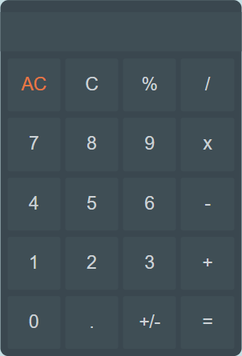

<h1 align="center">Simple Calculator<h1>

 <h4 align="center">A "Simple Calculator" é uma aplicação web que representa uma calculadora. O projeto é voltado a estudos e ao aperfeiçoamento utilizando HTML (HyperText Markup Language) como linguagem web de marcação, CSS (Cascading Style Sheets) para estilização e JS (JavaScript) para as ações por trás do código.</h4>
     
 

## 🚀 Tecnologias

- [HTML](https://devdocs.io/html/)
- [CSS](https://devdocs.io/css/)
- [JAVASCRIPT](https://devdocs.io/javascript/)

 

<h3 align="center">Web and Mobile View<h3>

    

 

<h5 align="center">Criado por Vitor Ribeiro<h5>
